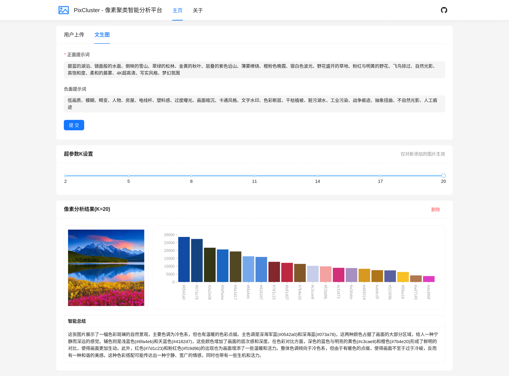

# PixCluster - 像素聚类智能分析平台

本项目为数据可视化课程大作业，主要功能为对图片的像素值进行聚类并将结果使用数据图表进行可视化

<p align="center">
  
  
  
  
  
  
  
  
</p>

## 🌐 网站截图

<p align="center"></p>

## ✨ 特色功能

### 🚀 高效聚类后端引擎
- 基于 **Go语言** 构建高性能后端接口
- 依托于 **函数计算** 基础设施构建高可用、高弹性、低成本的服务
- 采用 **KMeans++ 聚类算法** 实现图片像素级颜色聚类分析
- 通过 **Goroutine 协程并发** 优化计算效率，支持高并发图片处理任务
- 支持多种格式的图片解析，自动提取RGB/HEX色彩值进行聚类分析

### 🌀 AI文生图与智能分析
- 集成 **通义万相API** 实现文生图功能，用户输入prompt即可生成创意图片
- 生成图片自动触发聚类分析流水线，实时返回颜色分布数据
- 调用 **通义千问视觉模型** 对聚类结果进行多维度解读，生成图文分析报告

### 🎨 交互式数据可视化
- 使用 **Ant Design Charts** 构建动态柱状图，直观展示颜色簇分布比例
- 支持图表颜色映射预览，鼠标悬浮可高亮对应颜色簇
- 提供聚类中心具体HEX值，方便设计师直接取用配色方案

### 🖥️ 全场景响应式布局
- 采用响应式布局方案，完美适配桌面/平板/手机等设备
- 基于CSS断点动态重组界面，小屏幕自动省略次要内容
- 图片上传区智能缩放，生成结果自适应屏幕分辨率

### 🧬 智能化工作流
- 从「文字→生成图片→聚类分析→可视化→智能报告」全流程自动化
- 各模块间通过异步函数进行执行，支持分析结果逐步展示
- 错误重试机制与加载状态优化，保障长流程操作体验

## ⚡ 快速开始

### 1. 克隆仓库

```bash
git clone https://github.com/fenggwsx/PixCluster.git && cd PixCluster
```

### 2. 启动前端开发服务器

```bash
pnpm --prefix web dev
```

### 3. 配置代理服务器

> [!NOTE]
> 代理服务器用于解决开发环境下的跨域问题

1. 复制环境模板文件：

```bash
cp proxy/.env.example proxy/.env
```
2. 编辑`proxy/.env`文件，配置实际的后端地址：

```env
# Frontend
FRONTEND_URL=http://localhost:3000

# Backend
BACKEND_URL=https://example.com
```

### 4. 启动代理服务器

前台运行模式：
```bash
pnpm --prefix proxy start
```

后台运行模式：
```bash
pnpm --prefix proxy start &
```

> [!TIP]
> 可使用`jobs`命令查看后台进程，使用`kill <pid>`命令关闭指定后台进程

### 5. 访问应用

打开浏览器访问[http://localhost:9000](http://localhost:9000)
